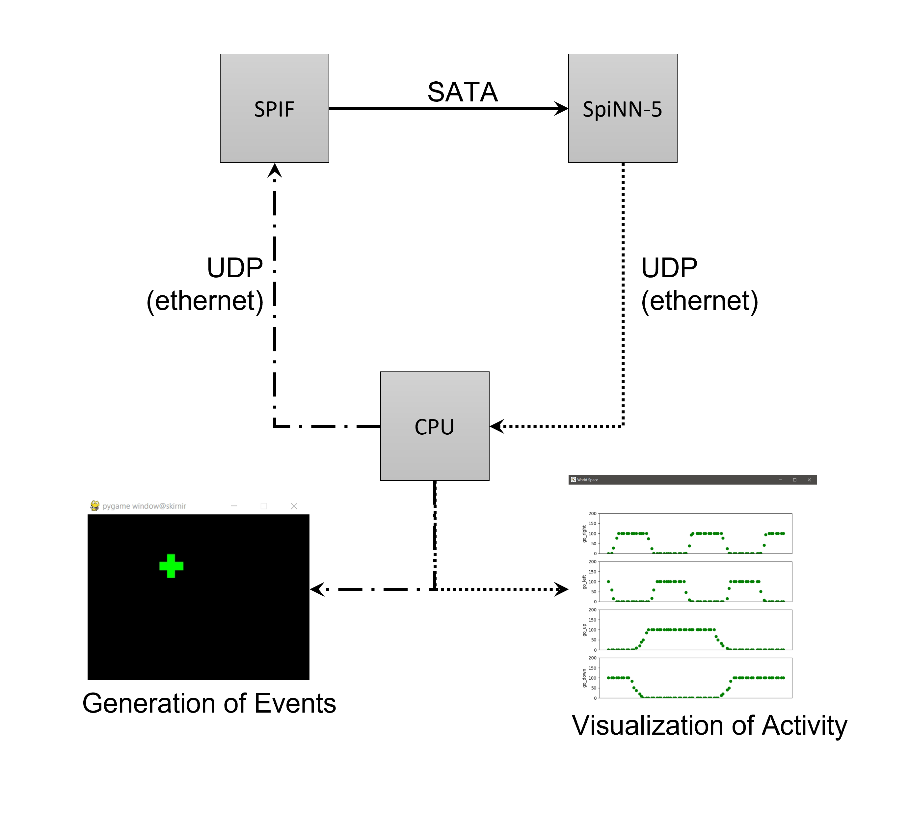
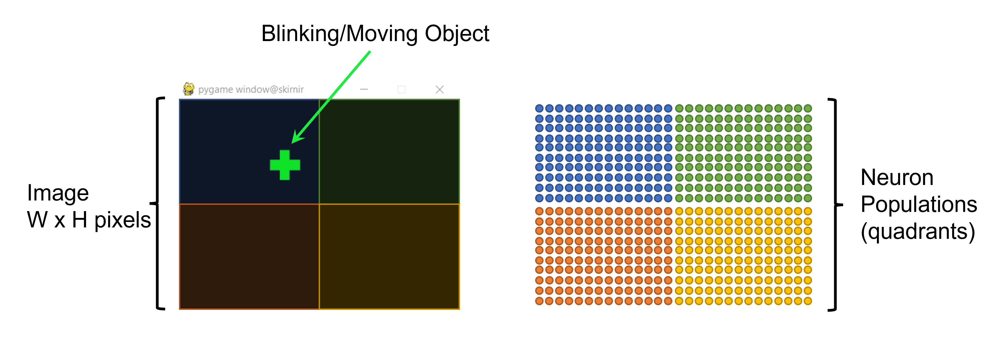
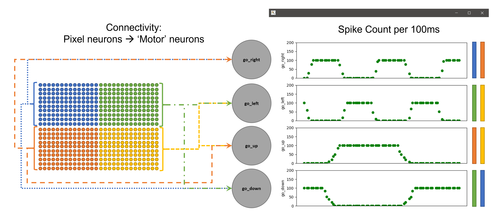
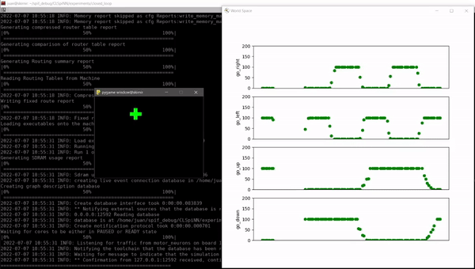

# CLSpiNN
Once cloned, change directory to ```CLSpiNN/experiments/closed_loop/``` where the script ```vor.py``` is present.

Such script simulates a moving/blinking object which is seen by a simulated event-based camera which, in turn, generates events based on the motion and blinking of the stimulus and sends them to a SpiNN-5 through SPIF so they can be 'processed' in SpiNNaker using a very simple neuronal architecture whose output layer's activity is visualized.



Each pixel of the camera is mapped to a neuron in a SpiNN-5 through the SPIF to establish an input layer. The neurons in that input layer are divided into 4 populations depending on the quadrant their corresponding pixel belongs to. 



Each of these 4 populations is then connected to two neurons: quadrant 1 (top left) is connected to go_right and go_down; quadrant 2 (top right) is connected to go_left and go_down; quadrant 3 (bottom left) is connected to go_right and go_up; quadrant 4 (bottom right) is connected to go_left and go_up. 




The visualization of output layer activity is done by counting spikes in 100ms windows.

# Example
Run ```python3 vor.py``` to use default parameters:

The visualization of moving/blinking object and activity in the output layer should look like the following video (although less pixelated):


Or run ```python3 vor.py -w 28 -r 40 -p 3333 -i 172.16.223.98 -m auto``` to 'manually' set parameters

# Help?
```python3 vor.py -h```
